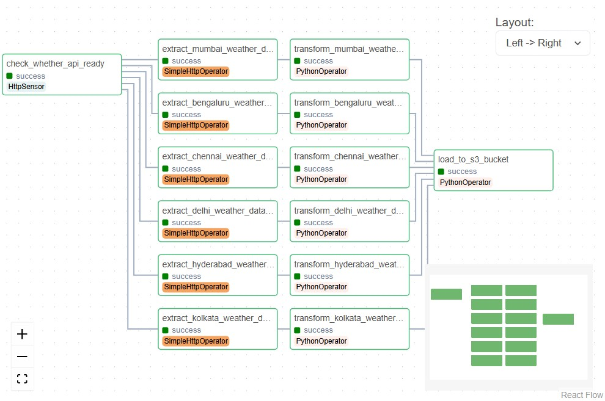
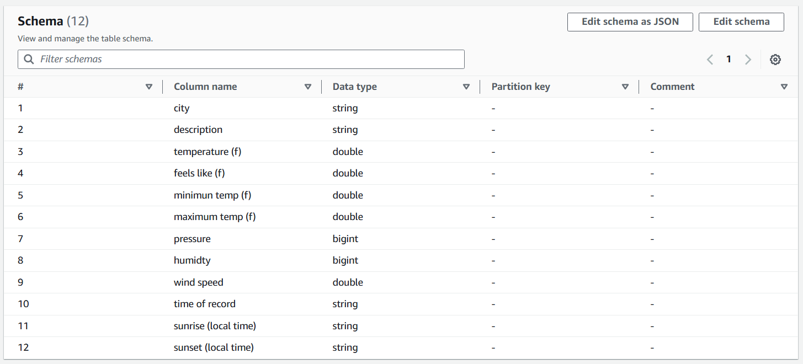
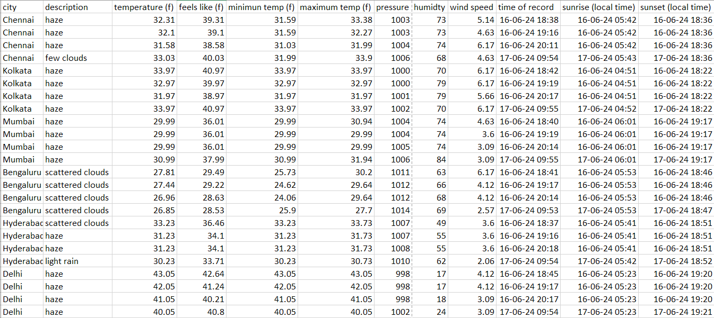
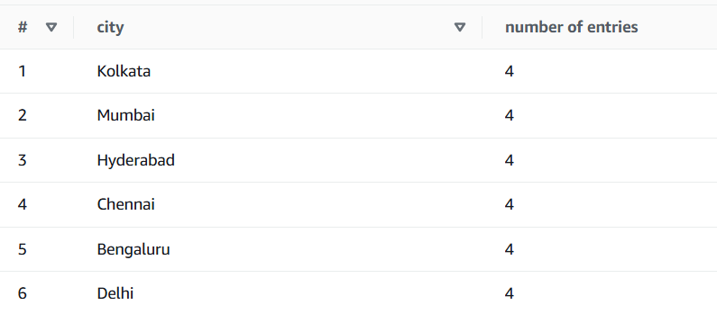
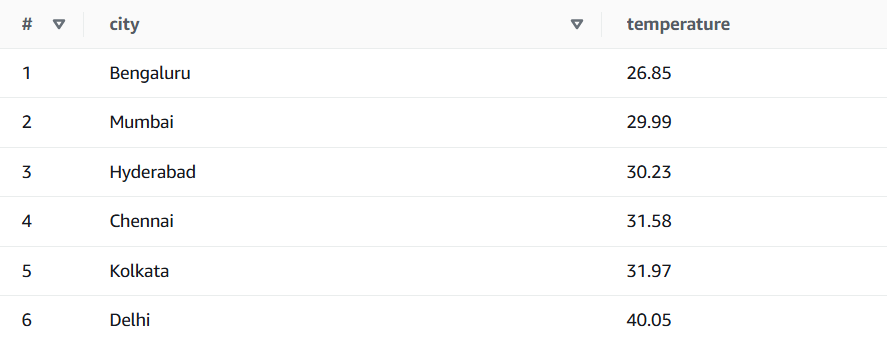
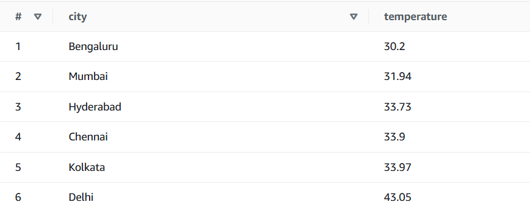
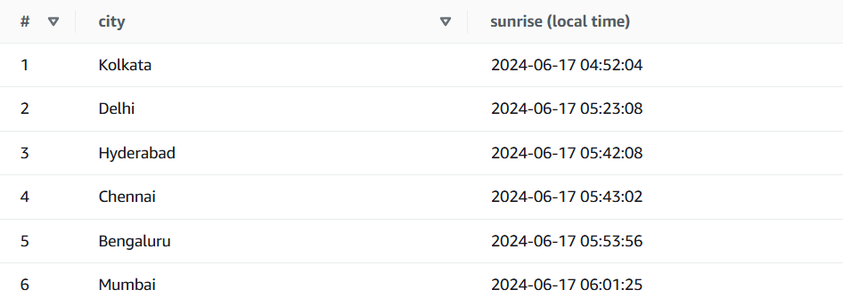
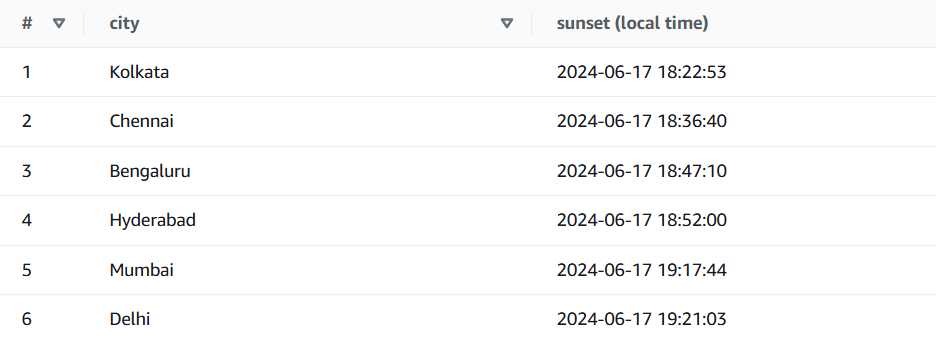
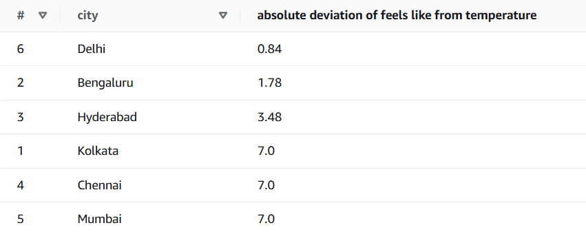
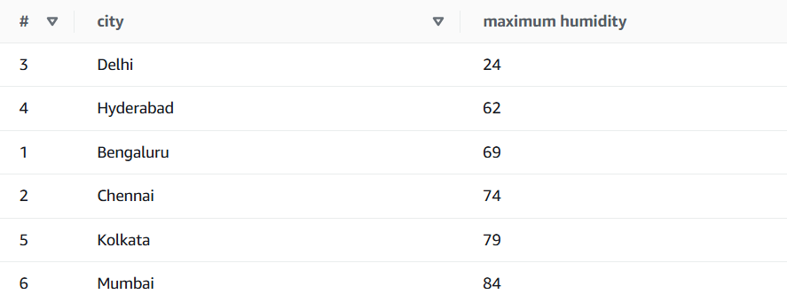

# Automated ETL pipeline for weather data of 6 Indian cities

This repository contains an automated ETL (Extract, Transform, Load) pipeline for weather data of six Indian cities: Delhi, Mumbai, Bengaluru, Chennai, Hyderabad, and Kolkata. The ETL pipeline is controlled by Apache Airflow and utilizes the OpenWeatherMap API to extract weather data. The extracted data is transformed into a Pandas DataFrame and then loaded onto an S3 bucket for storage. Meanwhile, AWS Glue Crawler is used to automatically create a schema and a database, facilitating structured storage and easy access. Finally, AWS Athena is employed to query and analyze the weather data, enabling insightful data exploration and analysis.


## How To Run
**Pre-Requisites**
- Docker Desktop

**Steps to Setup**
1. Clone this repository

2. Initialise `airflow.cfg` with default values
    ```bash
    docker compose run airflow-cli airflow config list
    ```
3. Initialise the database
    ```bash
    docker compose up airflow-init
    ```

4. Install all the required libraries (if not available)
    - Access the bash terminal of the docker container
        ```bash
        ./airflow.sh bash
        ```
    - Run this command in the bash terminal
        ```bash
        pip install pandas boto3
        ``` 

5. Create the `.env` file to store the API keys & secrets.
    ```
    AWS_KEY=...
    AWS_SECRET=...
    WEATHERMAP_API_KEY=...
    ```

**Steps to Run**
1. Run this command in the terminal
    ```bash
    docker compose up
    ```
2. Access the airflow web interface at `http://localhost:8080`.
3. The default account has the login `airflow` and the password `airflow`.


## ETL Architecture
**Extraction**: Weather data is extracted from the OpenWeatherMap API for Delhi, Mumbai, Bengaluru, Chennai, Hyderabad, and Kolkata.

**Transformation**: The extracted data is transformed into a Pandas DataFrame, ensuring a consistent and structured format.

**Loading**: The transformed data is loaded into an S3 bucket for storage.
The pipeline is orchestrated using Apache Airflow, ensuring reliable and scalable execution.

## DAG


## AWS Glue Crawler
When AWS Glue Crawler service is configured and run, it connects to the S3 bucket, analyzes the objects and the structure of the objects, and infers the schema, including table definitions and data types. This information is then stored in the AWS Glue Data Catalog, making it readily accessible for ETL processes, querying, and analysis later in AWS Athena.


## AWS Athena
Using AWS Athena, we can integrate seamlessly with AWS Glue, allowing us to use the database and tables created by AWS Glue Crawlers for querying and analysis through SQL queries.

### Query Analysis
#### 1
```sql
SELECT * FROM "weather-dag-etl"."weather_api_airflow_dag_udit";
```


This query lists all the rows in the table.

#### 2
```sql
select city, count(*) as "number of entries"
from weather_api_airflow_dag_udit group by city;
```


This query lists the cities and the number of rows for each city in the table.

#### 3
```sql
select city, round(min("temperature (f)"),2) as temperature
from weather_api_airflow_dag_udit group by city order by temperature;
```


This query retrieves the minimum temperature (rounded to two decimal places) for each city from the table. It groups the results by city and orders them by the minimum temperature in ascending order.

#### 4
```sql
select city, round(max("maximum temp (f)"),2) as temperature
from weather_api_airflow_dag_udit group by city order by temperature;
```


This query retrieves the maximum temperature (rounded to two decimal places) for each city from the table. It groups the results by city and orders them by the maximum temperature in ascending order.

#### 5
```sql
select city, "sunrise (local time)" from weather_api_airflow_dag_udit
where "time of record"  like '2024-06-17%'
order by "sunrise (local time)";
```


This query retrieves the sunrise time for each city from the table for records dated June 17, 2024. It orders the results by the sunrise time in ascending order.

#### 6
```sql
select city, "sunset (local time)" from weather_api_airflow_dag_udit
where "time of record"  like '2024-06-17%'
order by "sunset (local time)";
```


This query retrieves the sunset time for each city from the table for records dated June 17, 2024. It orders the results by the sunset time in ascending order.

#### 7
```sql
select city, round(max(abs("temperature (f)" - "feels like (f)")),3)
as "absolute deviation of feels like from temperature"
from weather_api_airflow_dag_udit group by city
order by 'absolute deviation of feels like from temperature';
```


This query calculates the maximum absolute deviation between "temperature (f)" and "feels like (f)" for each city in the table. It rounds the result to three decimal places and labels it as "absolute deviation of feels like from temperature." The results are grouped by city and ordered by the calculated deviation in ascending order. One striking observation here is that the deviation is inversely proportional to the distance of the city from the sea. In other words, cities that are closer to the sea have higher deviation while the cities that are far off from the sea have less deviation.

#### 8
```sql
select city, max(humidty) as "maximum humidity"
from weather_api_airflow_dag_udit group by city order by city;
```


This query retrieves the maximum humidity for each city from the table. It calculates the maximum humidity, labels it as "maximum humidity," groups the results by city, and orders them alphabetically by city name. Similar to the previous observation, the cities that are closer to the sea have more humidity compared to the cities that are far away.
